# Quick7 Buildguide

## Required Parts

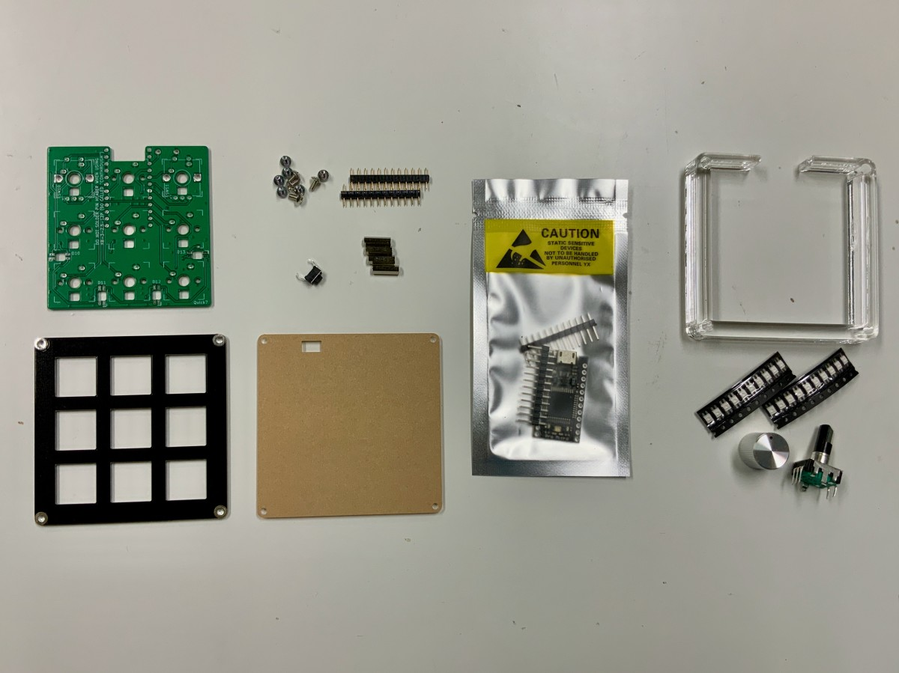

|Description|qty|note|
|---|---|---|
|PCB|1|
|Top Plate|1|
|Bottom Plate|1|
|Pro Micro (or other compatibles, eg: Elite-C)|1|"Sparkfun Qwiic Pro Micro" is not supported|
|Contrough|2|XB-3-2.5-12P from [MAC8](https://www.mac8japan.com/)|
|Reset switch|1|
|M2 10mm Stand-offs|4|Flat diameter 3mm|
|M2 4mm Screw|8|
|Cherry MX compatible keyswitches|7~9|Depends on Qty of Rotary Encoder|
|Cherry MX compatible keycaps|7~9|Depends on Qty of Rotary Encoder|
|Rubber feet|4|
 

### Optional Parts

|Description|qty|note|
|---|---|---|
|Acrylic Middle Plate|1|10mm Thick, fits around stand-offs|
|LED(YS-SK6812MINI-E)|13|for both key backlighting (consider transparent keycaps) and underglow|
|Rotary Encoder|1~2|Alps EC12E compatible, w/Pushswitch available|
|Knob|1~2|
 

## Tools

|Name|Note|
|---|---|
|Soldering iron|When use with YS-SK6812MINI-E LEDs, make sure that is temperature controllable|
|Lead solder|0.6mm-0.8mm diameter|
|Precision nippers to trim long legs|
|Screwdriver|PH1|
 

### Schematic is [here](Quick7.pdf)

## Before getting started
Please check all the steps of this build before starting. The total build time takes approximately an hour, depending on your skills and practice.

***For this build, we will handle a very hot soldering iron. If you leave your seat during the work, be sure to turn off the power and be careful not to get burned or injured.***

## Build steps
Here is the summary of building Quick7 keyboard.

1. Solder small parts
    1. YS-SK6812MINI-E LEDs
    1. Reset switch
    1. Conthrough (XB-3-2.5-12P)
1. Install main parts
    1. Switches
    1. Rotary Encoder(s)
1. Solder main parts
1. Install the controller
1. Flash firmware, test it
1. Assemble case
1. Put keycaps, knob(s) and rubber feet on

## 1. YS-SK6812MINI-E LEDs

When looking at the underside of the PCB, the white "L" shape indicates which corner the notched leg of the LED is put to. Take care to align the LEDs correctly, as they will only work when installed in the correct orientation. Note that from the soldering perspective, all LEDs are facing down, *not* up.

***The direction of the notch changes on each row.***

**Set the temperature of your soldering iron to 270 degree Celsius or less.**
Parts other than LEDs have a certain level of heat resistance and can be used at about 320 degree Celsius.

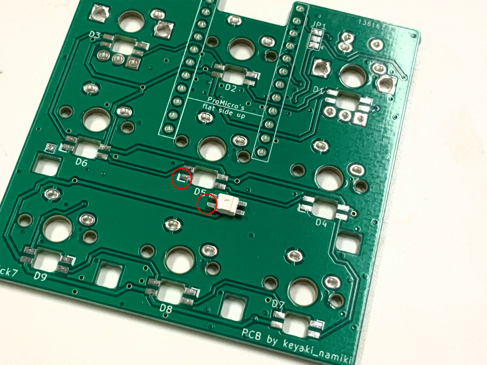

For UnderGlow, use these holes and solder from the other side, again taking care to match the LED notch to the white marker. The LEDs still point down when soldering, and face the opposite direction to the previously soldered LEDs.

## 2. Reset switch

Install the reset switch and solder from top side (opposite side to the first nine LED solder jobs, same side as the underglow LEDs). This switch will face to the bottom of the device, there is a cut-out in the bottom acrylic plate for it.

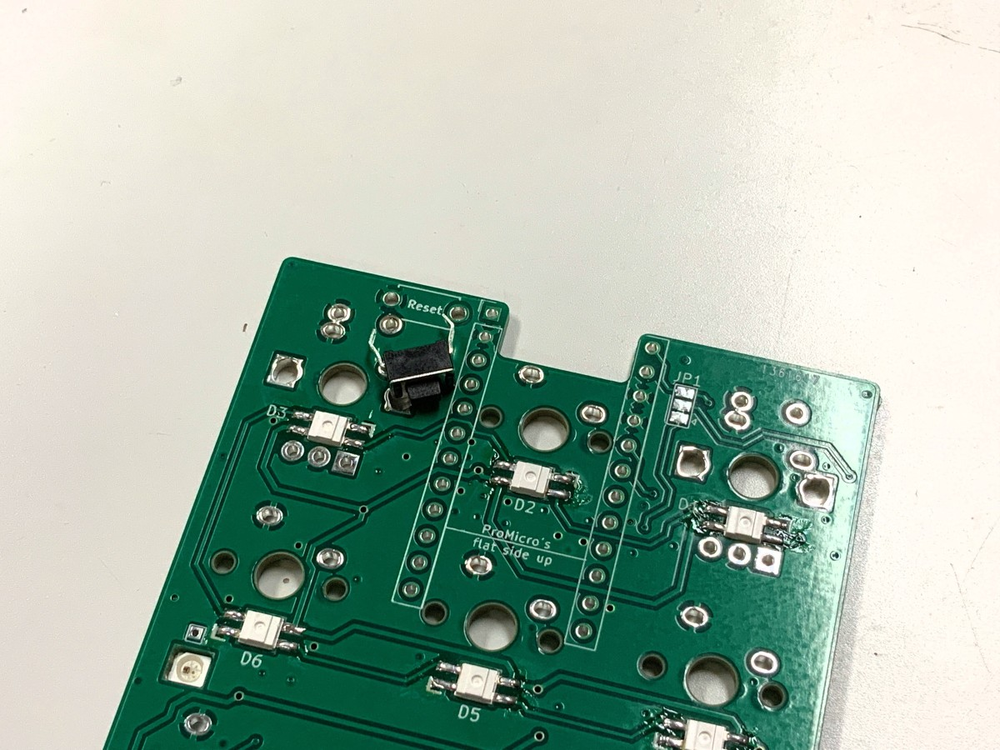

Parts we soldered so far (underside view).

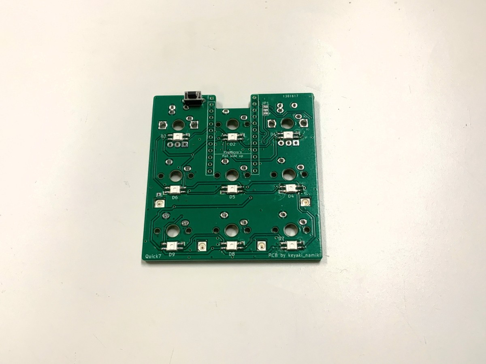

(top view)

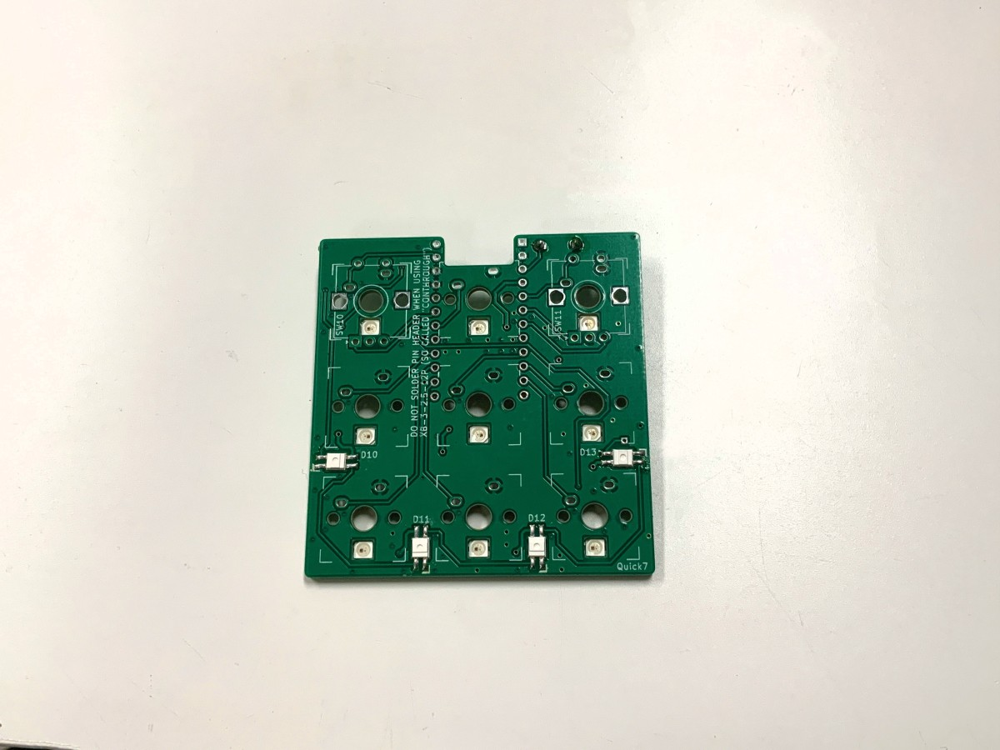

## 3. Contrough (XB-3-2.5-12P)

The small windows should be on the Pro Micro side.
***DO NOT SOLDER THE HEADERS TO THE MAIN PCB.*** They will be sufficiently held in by spring tension.

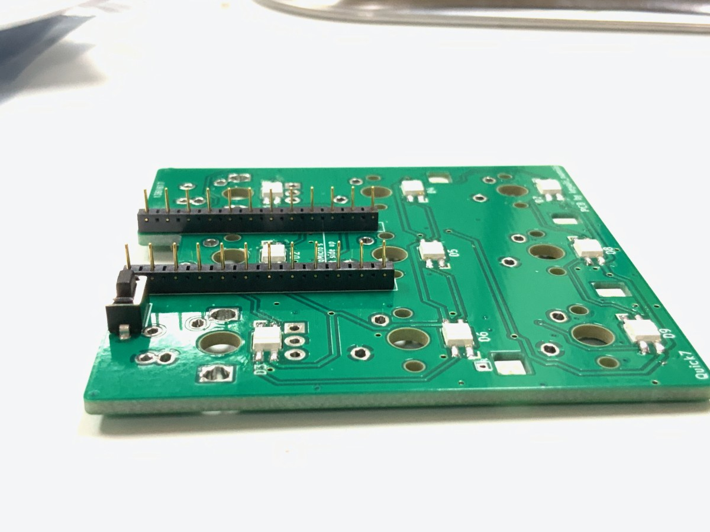

**Remove** Pro Micro and headers from the PCB when soldering is completed.

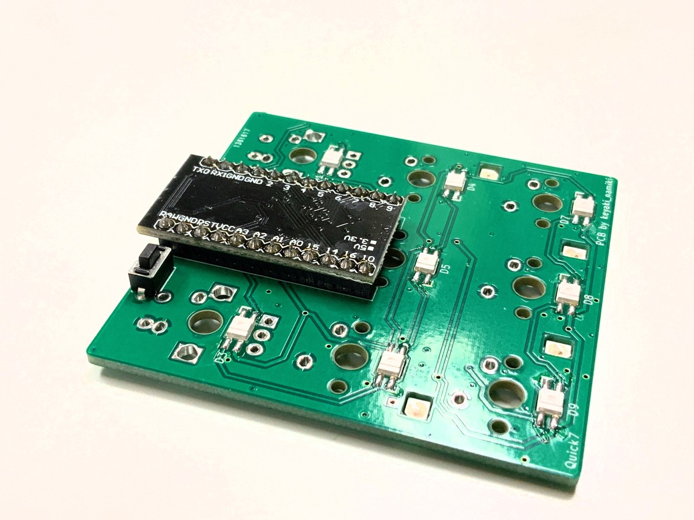

## 4. Install Switches

Check the orientation of Top Plate and mount switches on. The plate indicates the underside with masking (not shown in this photo). Newer versions have "Quick7" logo in the bottom-right hand corner of the top side of the plate.

If you have rotary encoders to install, be sure to leave the top left / top right switch locations free for them, as they can only be installed in those two spots.

## 5. (Optional) Install Rotary encoder(s)

If you have purchased rotary encoders, put them on the top side of main board (SW10/SW11). They can only be installed in the top left and top right hand corners of the device. If you have not purchased them, the spots should already be occupied by switches.

## 6. Solder Switches and Rotary encoder(s)

Before starting to solder the switches in place, cut the legs of them indicated here to avoid shorting them to the Pro Micro. 

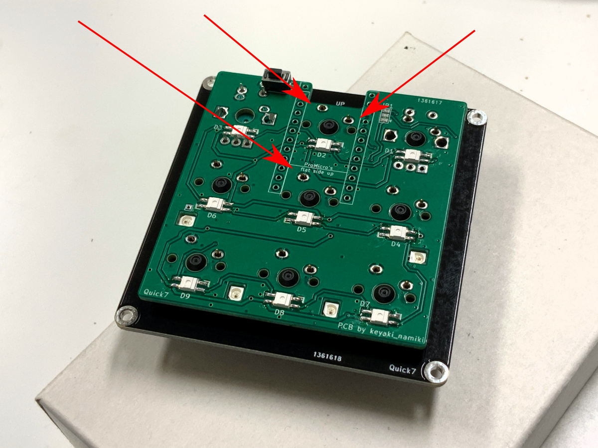

Then, solder all pins

and Rotary Encoder(s).

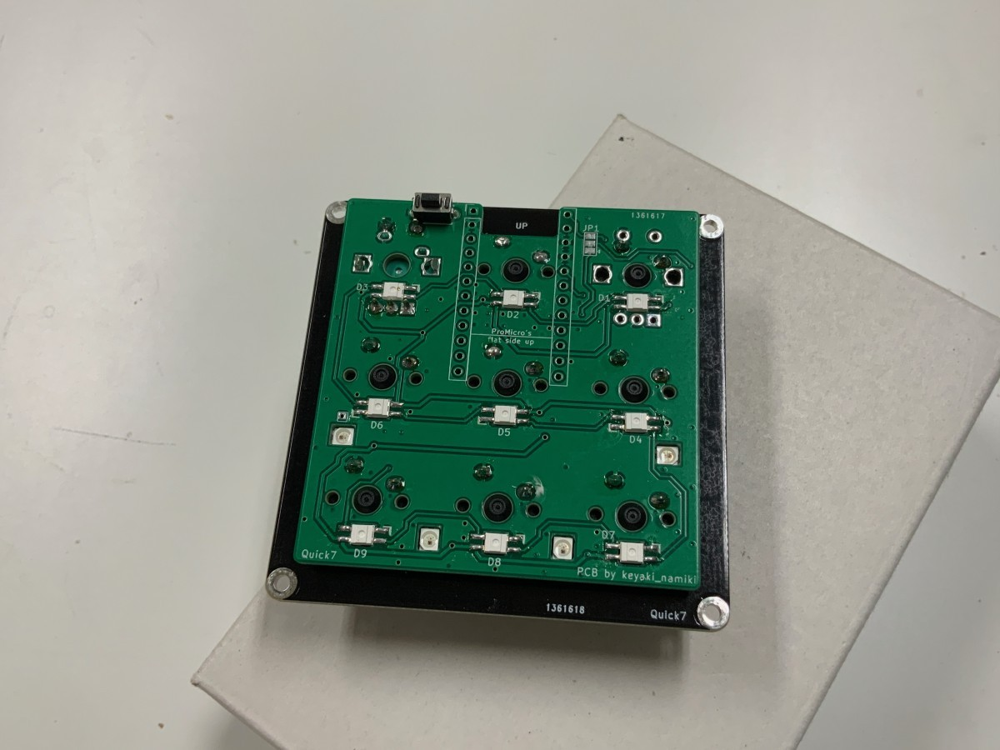

## 7. Install the controller

Put the Pro Micro controller (removed from PCB at step.3) on the board. It does not need to be soldered, the headers will hold it in place with spring tension. Furthermore, the controller can be easily replaced at a later date if desired (for example, with an Elite-C model, which is pin-compatible).

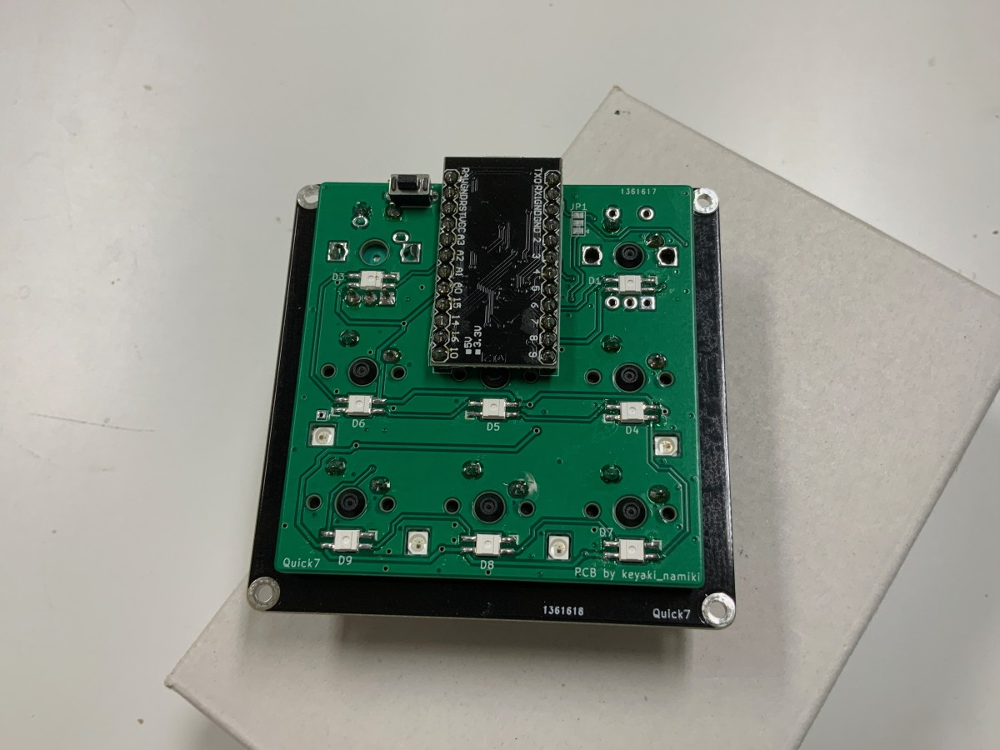

## 8. Flash firmware, test it

Please refer [Official Documentations](https://docs.qmk.fm/) of qmk_firmware and flash your firmware.

## 9. Assemble the case

Put standoffs on PCB with screws.

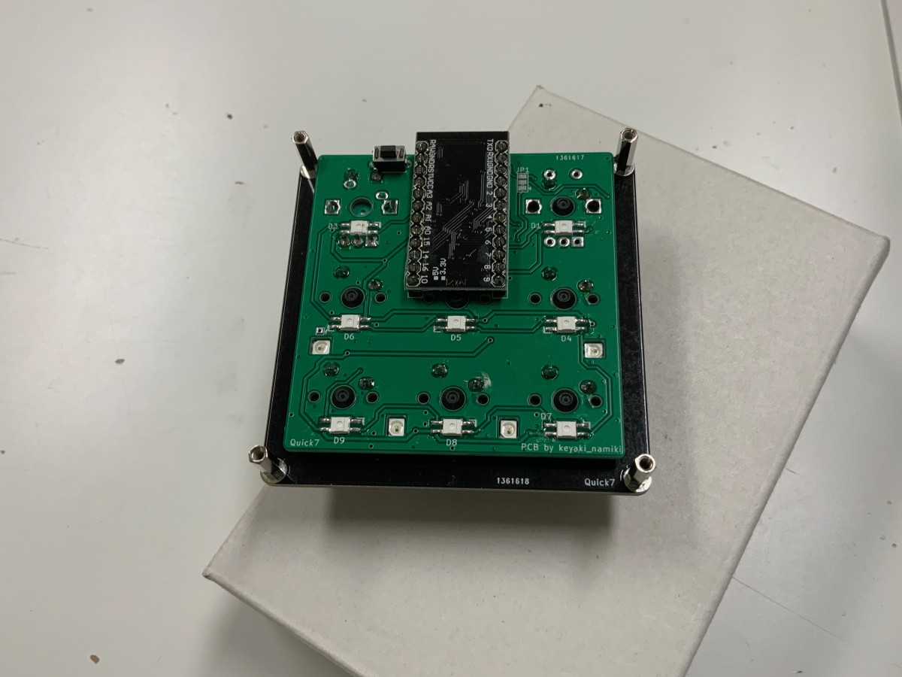

If you are using a transparent plastic middle plate, insert it now. It will fit over the stand-offs.

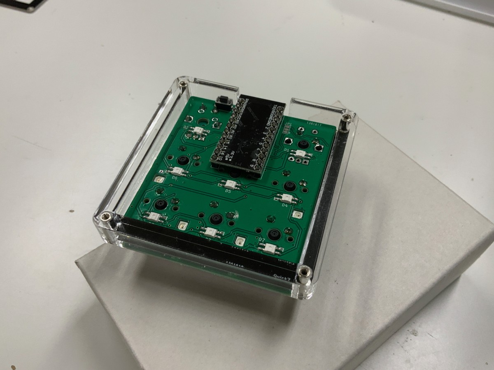

Finally, add the bottom acrylic plate, and screw it together with the remaining screws. Do not overtighten too much, or you might crack the plastic.

## 10. Put keycaps, Knob(s) and rubber feet on

You're done!
