# Helix rev3 LP 組み立てガイド

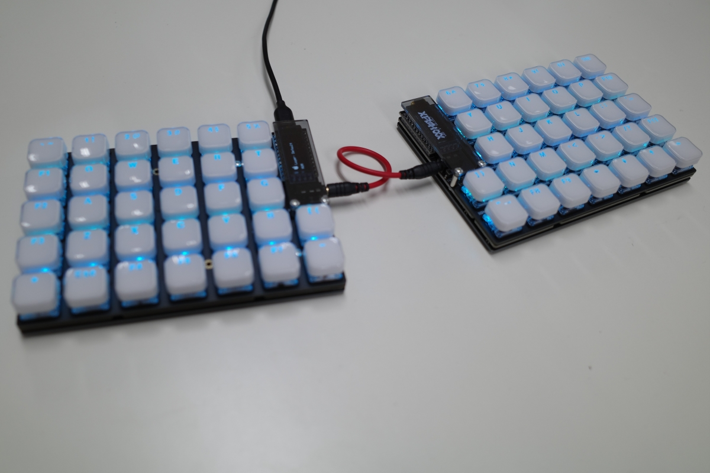

## 必要な部品

表と写真を見比べて、必要な部品が揃っているかどうかご確認ください。

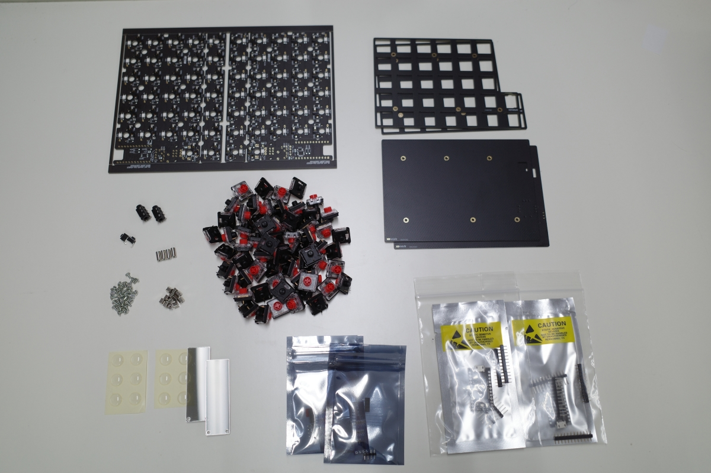

|部品名|数量|備考|
|---|---|---|
|基板|1|
|トッププレート|2|
|ボトムプレート|2|
|ProMicro保護プレート|2|
|ProMicro|2|
|コンスルー|4|
|タクトスイッチ|2|
|TRRSジャック|2|
|OLED/ピンヘッダー/ピンソケット|各2|
|M2ネジ|32|
|M2スペーサー 4mm|12|
|M2スペーサー 8mm|4|
|Kailh Choc/Choc v2スイッチ|最大64|
|選択したキースイッチに対応するキーキャップ|キースイッチと同数|Choc v2を使用する場合はトッププレートに干渉しないものをお選びください|
|ゴム足|12|
 

### オプション部品

|部品名|数量|備考|
|---|---|---|
|ロータリーエンコーダ|最大2つ|
|ロータリーエンコーダ用ノブ|最大2つ|

## 必要な道具

|名称|備考|
|---|---|
|はんだごて|
|はんだ線|0.6mm~0.8mmのもの|
|ドライバー|
|ペンチ/ラジオペンチ|基板を折り取るときに使用します|
|やすり|折り取った基板の断面を整えるときに使用します|

## 組み立ての前に

**実際の組み立てを始める前に、この組み立てガイドを最後までお読みください。**

この組立作業において、先端の熱いはんだごてを使用します。席を離れる際には電源を切るなど、怪我ややけどには十分ご注意ください。

## 組み立ての手順

大まかな流れは以下のとおりです。

1. 左右基板の分離
1. TRRSジャックとリセットスイッチのはんだ付け
1. コンスルーのはんだづけ
1. OLEDのはんだづけ
1. (オプション)ロータリーエンコーダの取り付け/はんだ付け
1. キースイッチの差し込み
1. ファームウェアの書き込みと動作確認
1. ボトムプレートの固定

## 1. 左右基板の分離

ペンチやラジオペンチなどを使い、フチの部分を折り取ります。
このとき、繊維状の突起物が発生しますのでやすりなどで取り除きます。

## 2. TRRSジャックとリセットスイッチのはんだ付け

TRRSジャックとリセットスイッチをそれぞれ差し込み、はんだ付けします。

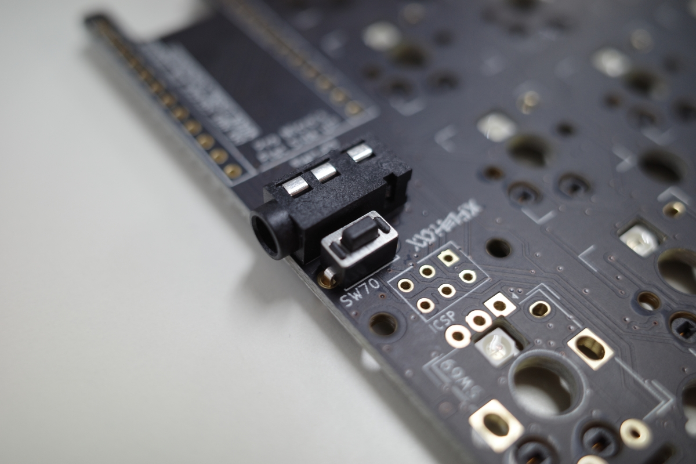

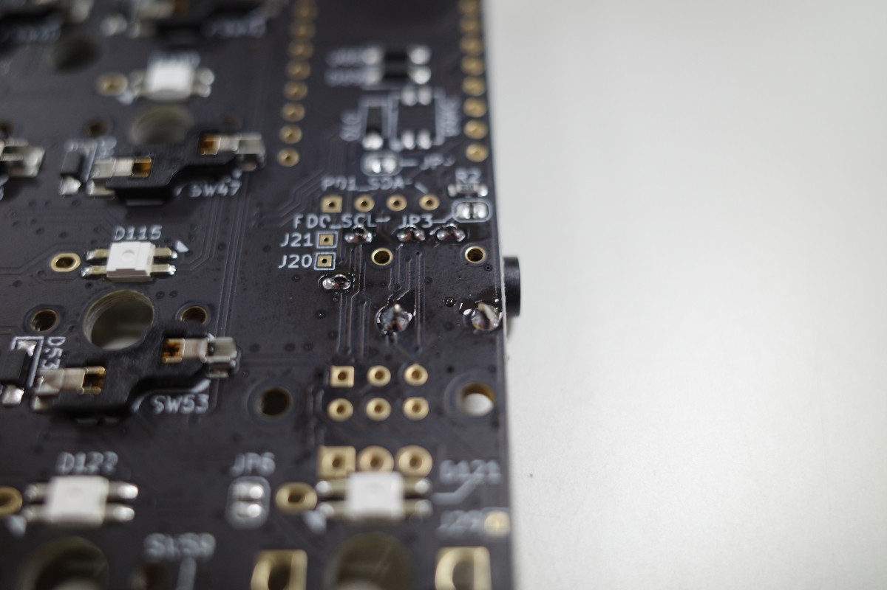

## 3. コンスルーのはんだ付け

コンスルーを基板に差し込み、ProMicroとコンスルーをはんだ付けします。このとき、**キーボード本体の基板とコンスルーとははんだ付けしません。** はんだ付けした状態でも使用上の問題はありませんが、***ProMicroの交換が極めて難しくなります。*** ProMicroに不具合が生じた際に交換できるよう、キーボード本体とははんだ付けせず、コンスルーの保持力によって固定することをお勧めします。

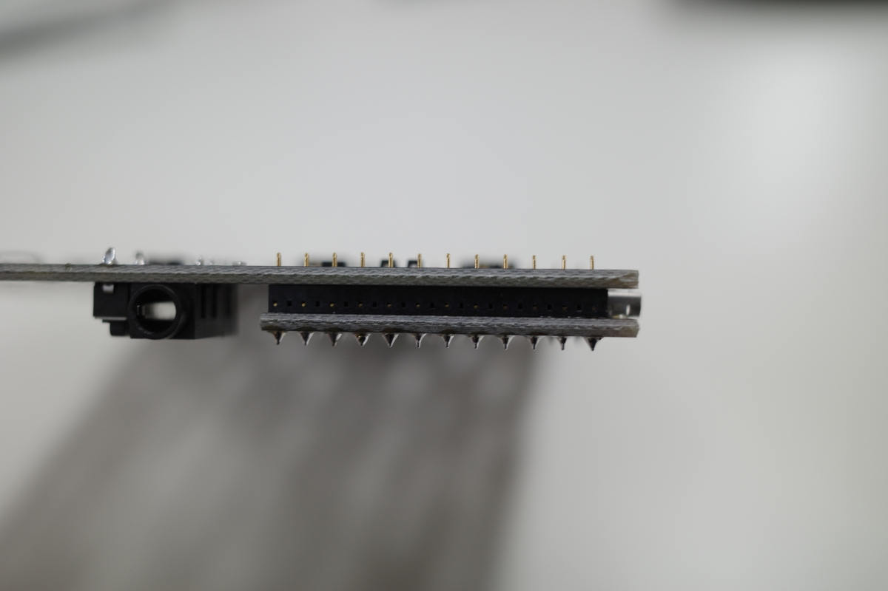

## 4. OLEDのはんだ付け

キーボード本体の基板とピンソケットを、OLEDモジュールとピンヘッダーをそれぞれはんだ付けします。

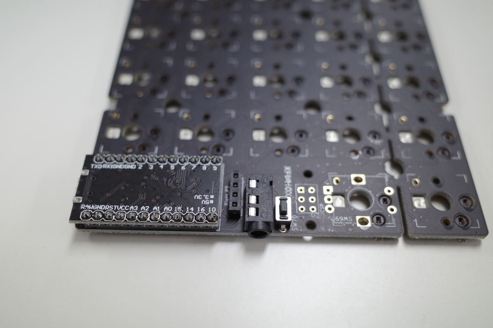

OLEDモジュールはProMicro上部にかぶせるようにのせ、はんだ付けします。

## 5. (オプション)ロータリーエンコーダの取り付け/はんだ付け

ロータリーエンコーダを使用する場合は、ここで取り付けし、はんだ付けします。

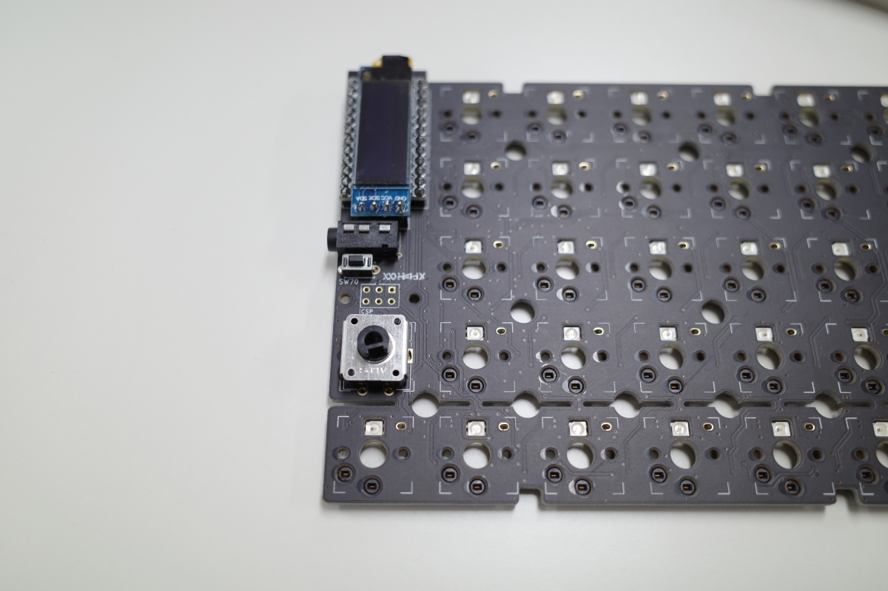

スイッチ付きのものを使用する場合は、スイッチ部のピンを適当な長さに切りそろえます。

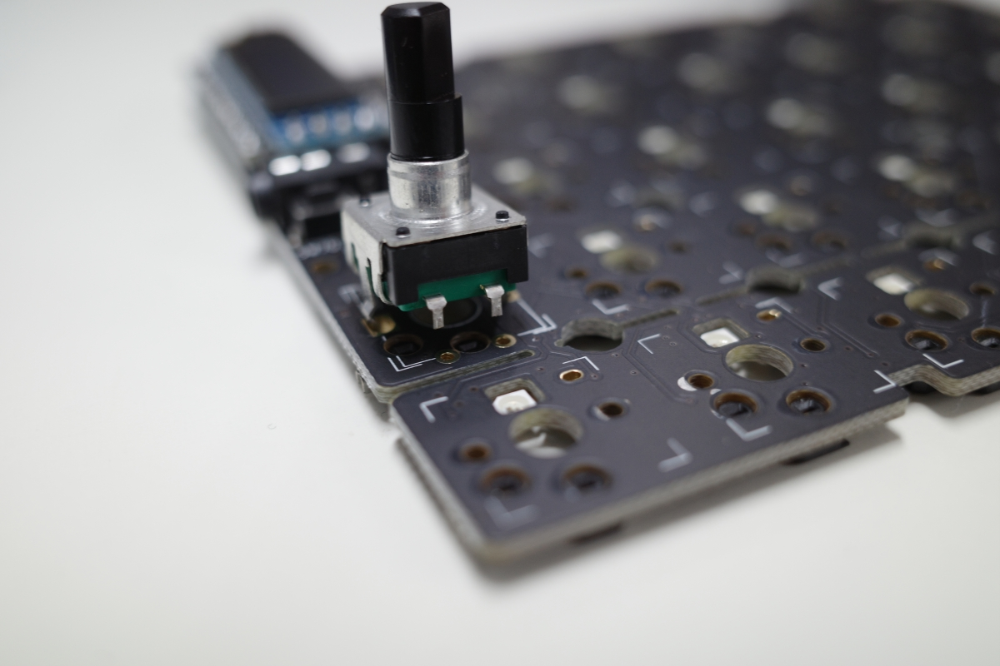

## 6. キースイッチの差し込み

トッププレートに選択したキースイッチを差し込みます。スイッチには向きがありますのでご注意ください。

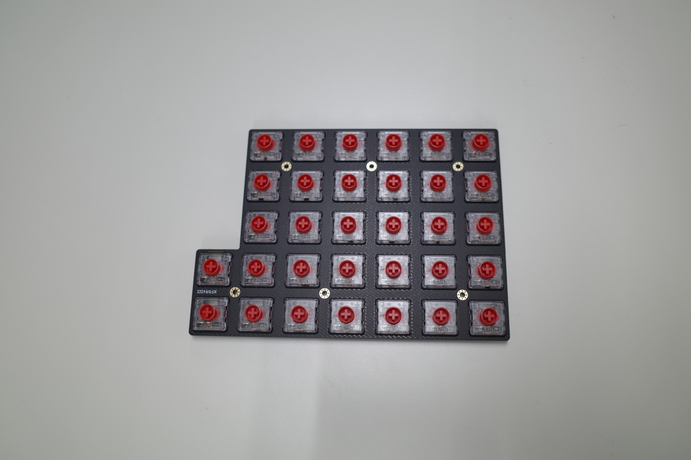

すべてのキースイッチを差し込み終わりましたら、トッププレートとキーボード本体の基板を組み合わせます。

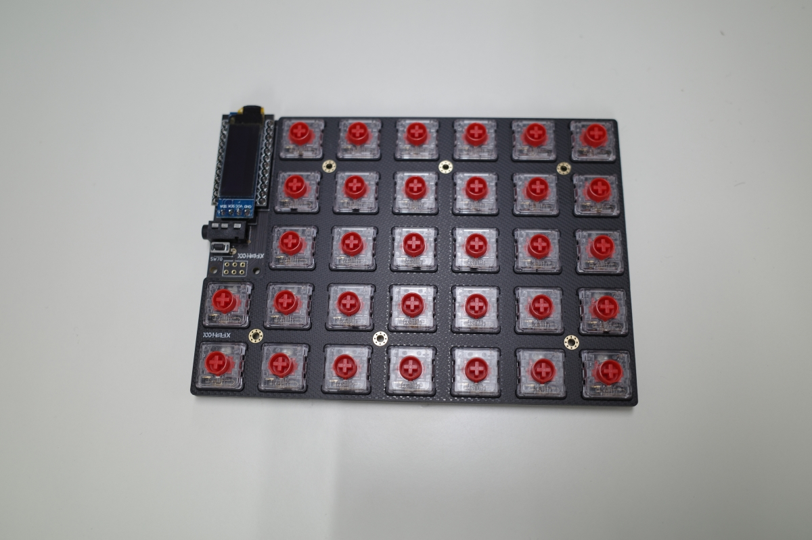

## 7. ファームウェアの書き込みと動作確認

ここで、ファームウェアを書き込み、動作確認をします。

Helix rev3はQMK_firmwareを使用しています。 [公式のDocs](https://docs.qmk.fm/#/ja/)を参考に環境を用意し、書き込みます。

コマンドラインからの書き込みを予定している場合、必要な環境のダウンロードに時間がかかることがありますので、予めダウンロードを始めてからはんだ付け作業に入るとスムーズです。

初めての方は書き込むキーマップに`via`をおすすめします。このキーマップは書き込み後[VIA](https://caniusevia.com/)というGUIソフトから簡単にキーマップを変更することができます。(一部制限があります)

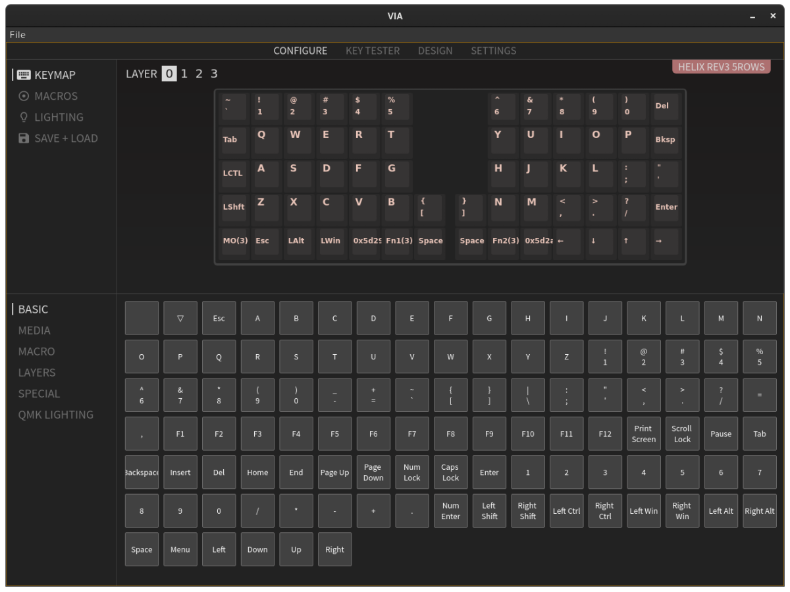

入力のテストには[こちら](https://config.qmk.fm/#/test)が便利です。

動作に問題がなければ、ProMicro保護プレートをネジ止めし、次の工程へ進みましょう。

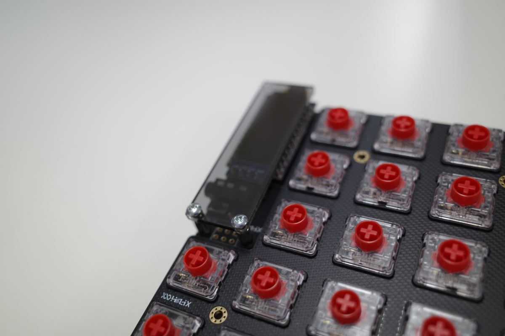

『故障かな？』と思ったら[こちら](TroubleShooting.md)

## 8. ボトムプレートの固定

スペーサーをねじで取り付け、ボトムプレートを固定します。

最後にゴム足を取り付けて、キーボードは完成です。 

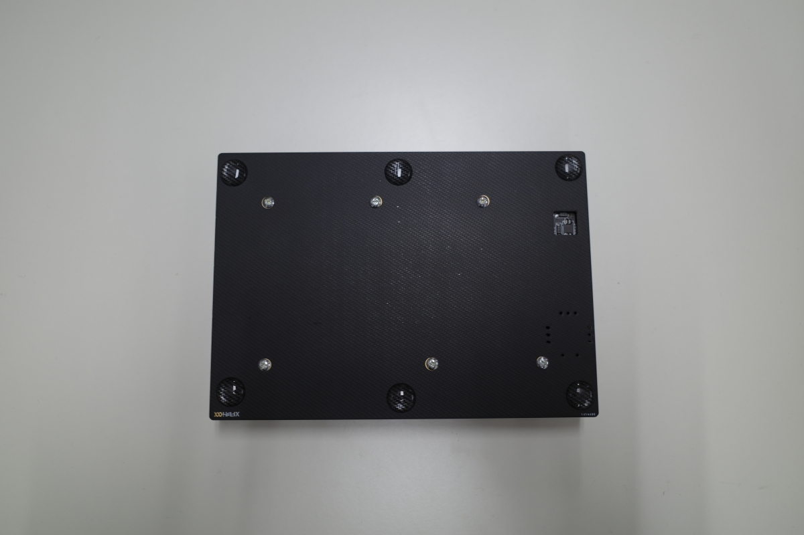

お好みのキーキャップを取り付けてご使用ください！

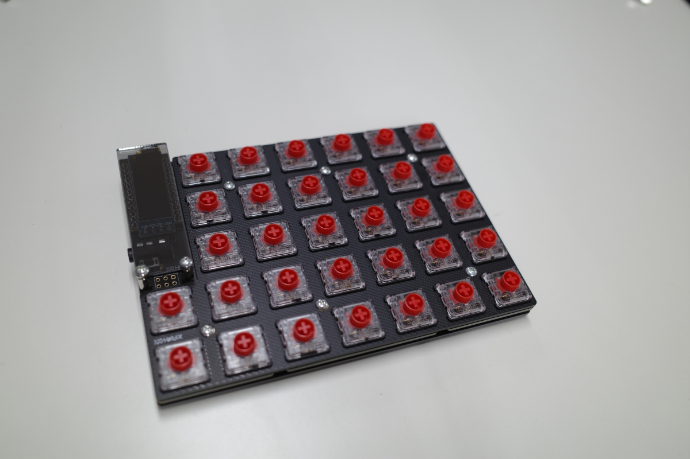
